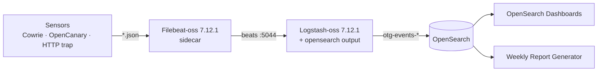

# Filebeat + Logstash ingestion (topology A)

OpenThreatGrid ingests with **topology A**: a **Filebeat** sidecar in each sensor
pod ships the sensor's JSON log to a single **Logstash**, which normalizes,
enriches, and writes events **directly** into OpenSearch.



A mature shipper handles **log rotation, truncation, checkpointing, and
backpressure** natively, so there is no custom tail/queue/consumer code to
maintain. Logstash owns all normalization in one pipeline; the cost is a
~1 GiB JVM for Logstash.

## Licensing (read this)

The **default** Filebeat/Logstash 7.12.1 are **Elastic-Licensed** — Elastic
relicensed at 7.11. OpenThreatGrid uses the **Apache-2.0 `-oss`** distributions:
`filebeat-oss:7.12.1` and `logstash-oss:7.12.1`. Filebeat cannot output to
OpenSearch directly (it version-checks for Elasticsearch), so **Logstash** writes
to OpenSearch via the `logstash-output-opensearch` plugin.

## The pipeline

[`otg.conf`](../deploy/filebeat-logstash/logstash/pipeline/otg.conf) branches on
the `log_type` Filebeat sets (cowrie / opencanary / http-trap):

- `translate` maps each sensor's `eventid` / `logtype` / `trap_event` → OTG
  `event_type` (unmapped events dropped).
- Cowrie: mmproxy localhost ports (`12222`/`12223`) normalized back to
  `2222`/`2223`; protocol derived; loopback `dst_ip` dropped.
- `uuid` → `event_id`, output `action => create` → **idempotent** (a retry never
  duplicates).
- `geoip` fills `geo_country` (vendored GeoLite2-City, offline); ASN optional.
- a shared `ruby` filter adds the OTG tags (protocol / ip-class / botnet command
  heuristics / payload / country / deception).
- `manage_template => false` — the OTG index template must be applied first
  (`scripts/bootstrap_opensearch.sh`), otherwise fields fall back to dynamic
  `text` and aggregations break.

## Run it

Local PoC (`docker compose`) and Kubernetes steps are in
[`deploy/filebeat-logstash/README.md`](../deploy/filebeat-logstash/README.md).
Always validate the pipeline first:

```bash
docker run --rm ghcr.io/openthreatgrid/otg-logstash:main \
  logstash -t -f /usr/share/logstash/pipeline/otg.conf
```

Add a new sensor by adding a Filebeat sidecar (`LOG_TYPE=<type>`) and an
`else if [log_type] == "<type>"` branch in `otg.conf` — see
[Sensor Integration](sensor-integration.md).
