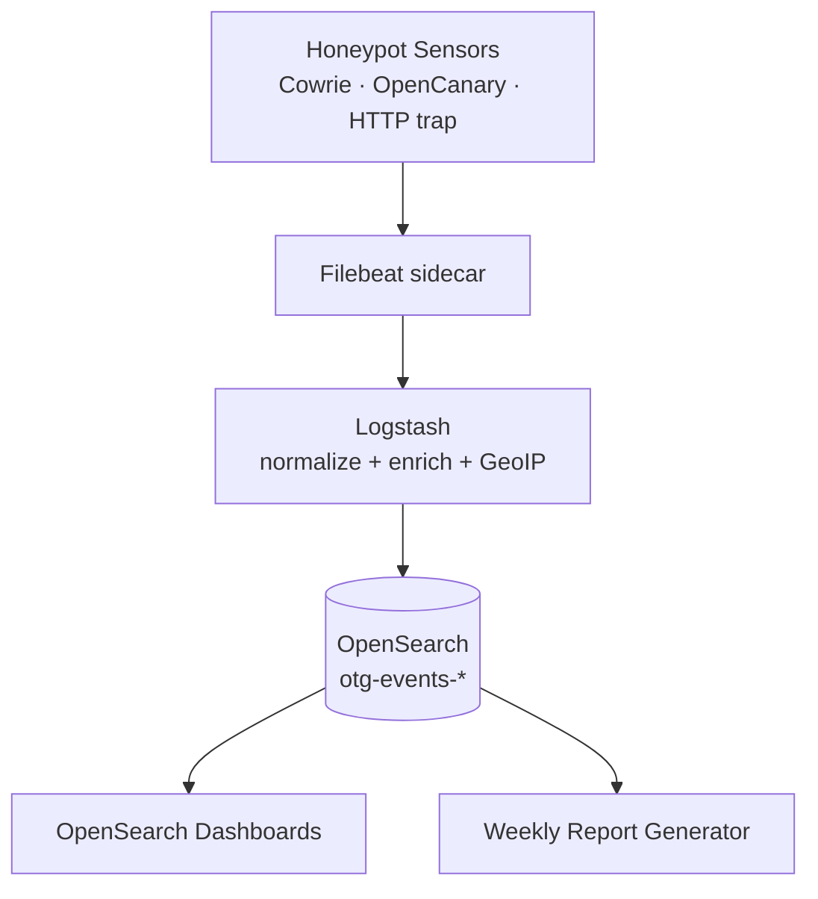

# OpenThreatGrid

**Open Source Threat Hunting & Intelligence** — a T-Pot-inspired,
OpenSearch-native honeynet platform for collecting attacker telemetry, hunting
botnet activity, analyzing suspicious behavior, and generating actionable cyber
threat intelligence reports.

OpenThreatGrid collects telemetry from distributed honeypot sensors, normalizes
attack events into a structured schema, stores them in OpenSearch, visualizes
attack activity in OpenSearch Dashboards, and generates weekly threat reports.

## Pipeline



## Quick start (local)

```bash
git clone https://github.com/OpenThreatGrid/openthreatgrid
cd openthreatgrid
./scripts/run_local.sh
```

- Dashboards: <http://localhost:5601> (Threat Overview)
- OpenSearch: <http://localhost:9200>
- Honeypot: `ssh -p 2222 root@localhost`

## Where to next

- **[Architecture](architecture.md)** — components and data flow.
- **[Event Schema](event-schema.md)** — the normalized OTG Standard Event.
- **[Deployment Guide](deployment-guide.md)** — Compose, Kubernetes, and Helm.
- **[Safe Honeypot Operation](safe-honeypot-operation.md)** — run it responsibly.

!!! warning "Defensive use only"
    OpenThreatGrid is for defensive security research, threat intelligence,
    education, and community protection. Do not use it to attack, compromise, or
    disrupt systems you do not own or have permission to test.
